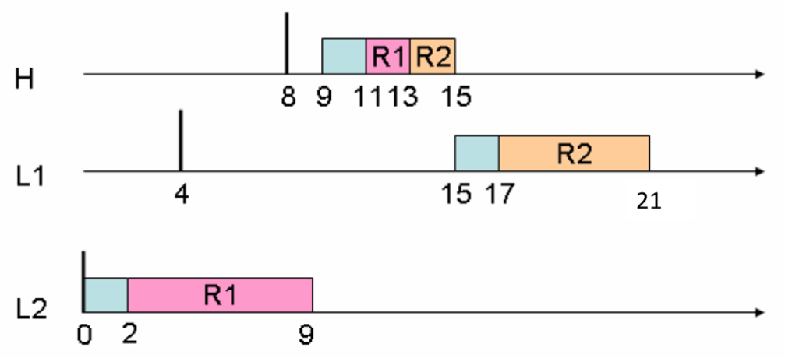
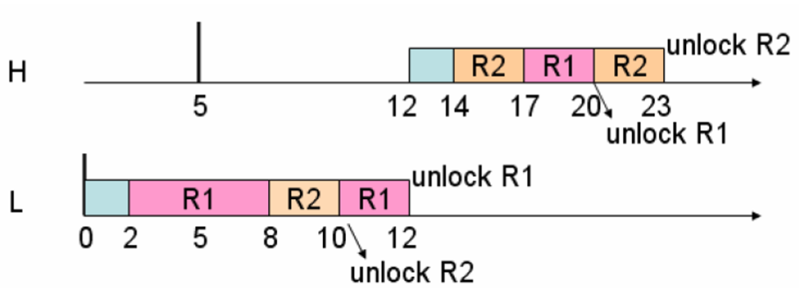

# Real-time Operating System Labs #

## Lab 1 : Periodic Task Emulation ##

#### Objectives ####

- To implement periodic tasks
- To observe the scheduling behaviors 
    - Fixed priority scheduling

#### Task Sets ####

Two sets of periodic tasks
- Task set 1 = { t1(1, 3), t2(3, 6) }
- Task set 2 = { t1(1, 3), t2(3, 6), t3(4, 9) }
- Tasks all arrive at the same time
- Show context switch behaviors
- Show deadline violations if there is any

#### Notes ####

- Add message at 3 place
    - `OSStart` : `preempt` (from `idle` to `task1`)
    - `OSInitExit` : `preempt`
    - `OS_Sched` : `complete`

- The deadline violation message should show its deadline rather than the time we know it
    - For example, in the set1, the task3 should violate at 9 tick, but we can only know it at 2x tick. In this case, we need to print `9` rather than `2x`

## Lab 2 : EDF Scheduler ##

#### Objectives ####

- To implement an EDF scheduler in uC/OS-II

#### Task Sets ####

Two sets of periodic tasks
- Task set 1 = { t1(1, 3), t2(3, 5) }
- Task set 2 = { t1(1, 4), t2(2, 5), t3(2, 10) }

#### Notes ####

- Use EDF scheduling at `OSStart`, `OSInitExit`, `OS_Sched`
- The following loop can iterate through the TCB list
    ```c
    OS_TCB *ptcb;
    for (ptcb = OSTCBList; ptcb != (OS_TCB*)0; ptcb = ptcb->OSTCBNext) {
        // do something
    }
    ```

## Lab 3 : Ceiling Priority Protocol ##

#### Objectives ####

- To implement **Ceiling Priority Protocol (CPP)** for ucOS’s mutex locks

#### Task Sets ####

Two scenario
- Scenario 1 : removing multiple blockings

    

- Scenario 2 : avoiding deadlocks
    
    

#### Notes ####

- For the pointers pointing to error message, the memory should be allocated before passing it as parameter (`OSMutexCreate`, `OSMutexPend`)
    ```c
    INT8U R1_error;
    R1 = OSMutexCreate(1, &R1_error);
    ...
    INT8U error;
    OSMutexPend(R1, 5, &error);
    ```
